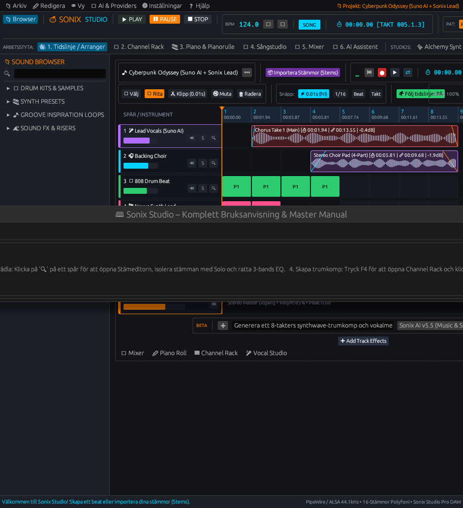
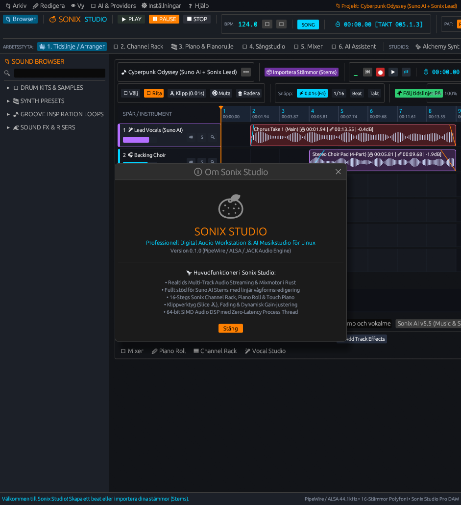

# 🍊 SONIX STUDIO - Professionell Linux DAW

Ett modernt, blixtsnabbt grafiskt musikproduktionsprogram skapat i **Rust** och **egui** med en integrerad modulär synthesizer, linjär flerspårs-audioredigerare med Suno AI-stöd, 16-stegs Channel Rack, Piano Roll, Sångstudio, Mixerbord och Touch-instrument för Linux (PipeWire / Wayland / ALSA / JACK).

---

## 🚀 Starta appen

Starta direkt från applikationsmenyn i Omarchy / Linux Desktop, eller kör från terminalen:

```bash
sonix
```

Eller kompilera och kör från källkod:

```bash
cd ~/Projects/sonix
cargo run --release
```

För att automatiskt generera alla 22 skärmdumpar i helskärm:

```bash
cargo run --release -- --capture-screenshots screenshots
```

---

## 🎨 Huvudfunktioner i Sonix Studio:

### 1. 🎛️ Metallic Top Toolbar & LCD Display:
* **Transportkontroller:** Taktila kontroller för `▶ PLAY`, `⏸ PAUSE`, `⏹ STOP`, `⏺ REC` och Loop.
* **Digital LCD:** Visar realtids-BPM, exakt speltid och taktposition med hundradelsprecision (`BAR 01 : 03 : 12 (+00cs)`).
* **Live Oscilloscope:** Högupplöst realtids-vågformsvisare och spektrumanalysator.
* **Taktila Rotary Knobs:** Högprecisions vridreglage för Master VOL, Master PAN och Stereo Width.

### 2. 🎼 Suno AI Stem Import & Linjär Audioredigering:
* **Direkt Zip/Folder-import:** Dra in eller öppna Suno Stem-arkiv/mappar (`vocals`, `drums`, `bass`, `guitar`, `keys`, `back_vocals`, etc.).
* **Realtids Vågformer:** Kontinuerliga ljudregioner med förrenderade och direktrenderade RMS- och peak-värden.
* **Klippverktyg (Slice ✂):** Klipp i ljudregioner var som helst på tidslinjen med millimeterprecision (0.01s).
* **Verktygspalett:** Välj (Pointer ⇱), Rita (Paint ✎), Klipp (Slice ✂), Radera (Trash 🗑), Muta (🔇).
* **Flerspårs Streaming:** Synkroniserad realtidsmixning direkt från ljudmotorn med noll latens och multithreaded decoding.

### 3. 🥁 Sonix Channel Rack (16-Stegs Sequencer):
* **6+ Dedikerade Spår:**
  1. 💥 `808 Kick Drum`
  2. 🥁 `909 Snare Drum`
  3. ⚡ `Crisp Closed Hi-Hat`
  4. 🌊 `Open Hi-Hat`
  5. 🎹 `303 Acid Synth Lead`
  6. 🎸 `Sub Bassline`
* **4-takt-stegknappar:** Taktila knappar grupperade i fyror med **lysande vita center-LEDs** vid aktivering.
* **Mute [M] & Solo [S]** med status-LEDs.
* **Mini VOL & PAN Knobs** för varje enskild kanal.
* **Sample Chopper & Pitch Shift:** Klipp och stäm om samplingar direkt i kanalstrippen.

### 4. 🎛️ Sonix Analog Synthesizer & Alchemy Synt:
* **Filter & Resonans:** Moog 24dB Ladder Lowpass filter med `CUTOFF` (Hz) och `RESO` (Q).
* **ADSR Envelope:** `ATTACK`, `DECAY`, `SUSTAIN`, `RELEASE`.
* **Live Envelope Graf:** Ritar upp den exakta kurvan i realtid.
* **Oscillatorer:** `∿ Sinus`, `⩘ Sågtand`, `⊓ Fyrkant`, `⋀ Triangel`.
* **Alchemy Vector Pad:** 8-punkters realtids-morph-yta för sömlös övergång mellan olika ljudkaraktärer.

### 5. 🎹 Sonix Piano Roll & Touch Piano:
* **Interaktiv Noteditor:** Polyfonisk pianoroll med dynamiska notlängder och anslagsdynamik (velocity).
* **Touch Klaviatur:** Taktilt virtuellt klaviatur med visuell neonfeedback och datortangentbordsstöd (A-K).
* **Skalsnäppning & Ackordstämpel:** Snäpp till dur, moll, pentatonisk eller stämpla hela ackord med ett klick.

### 6. 🎙 Sångstudio & Intelligent Harmonizer:
* **Mikrofoninspelning:** Spela in leadsång och stämmor med Take Lanes och direkt monitorlyssning.
* **Pitch Detection & Autotune:** Realtids pitchkorrigering och formantjustering.
* **4-Stämmig Harmonizer:** Generera automatiska körstämmor och stämsättningar.
* **Sampler Recorder:** Spela in egna samplingar och instrument direkt via mikrofonen.

### 7. 🎚 Master & Flerspårs Effects Mixer:
* **Multikanalsmixer:** Faders för varje spår, VU-mätare, Solo, Mute, Pan och Stereo Width.
* **Sub-Mix Bussar & VCA:** Dedikerade Drum Bus, Vocal Bus, Synth Bus samt 4x VCA-faders.
* **Parametrisk 3-Bands EQ:** Grafisk EQ-kurva med justerbara frekvenser och gain per band.
* **Master Effekter:** Space Reverb, Stereo Delay, Chorus, Kompressor och Tube Drive.

### 8. 🤖 AI Music Assistant, Patcher & Plugins:
* **AI Prompt Engine:** Skapa melodier, basgångar och ackord via textpromptar (Suno AI, OpenAI, Claude, Ollama).
* **Modular Patcher Grid:** Bitwig/FL Patcher-miljö med modulära noder och virtuella patchkablar.
* **AI Stem Separator:** Demucs Neural Engine för att isolera sång, trummor, bas och instrument från färdiga mixar.
* **Plugin Manager & Wine:** CLAP, VST3, LV2 och integrerad processisolering (sandboxing) via Yabridge/Wine.
* **Remix FX:** DJ Performance pad med Kaoss-matris, stutter, tape stop och bitcrushing.

---

## ⌨️ Tangentbords- & Snabbkommandoreferens

| Tangent / Genväg | Funktion | Beskrivning |
| :--- | :--- | :--- |
| **Mellanslag (Space)** | **Play / Pause** | Startar eller pausar uppspelningen i låt- eller mönsterläge. |
| **F1** | **Bruksanvisning / Manual** | Öppnar den inbyggda manualen och snabbguiden. |
| **F3** | **Tidslinje / Arranger** | Växlar till den linjära flerspårs-audiotidslinjen. |
| **F4** | **Channel Rack** | Växlar till 16-stegs trummaskinen och mönstereditorn. |
| **F5** | **Piano Roll** | Växlar till det grafiska notinmatningsfönstret. |
| **F6** | **Mixer Console** | Växlar till flerspårs-mixern och effektracken. |
| **F7** | **Analog Synthesizer** | Växlar till synteditorn med ADSR, Filter och Morph. |
| **F8** | **Vocal Studio** | Växlar till sångstudion, inspelning och harmonizern. |
| **Ctrl + I** | **Importera Stämmor** | Öppnar dialogen för att importera Suno- eller ljudfiler. |
| **Ctrl + E** | **Exportera Master / WAV** | Öppnar render-kön för att exportera WAV, MP3 eller stems. |
| **Ctrl + S** | **Spara Projekt** | Sparar det aktuella projektet. |
| **Ctrl + O** | **Öppna Projekt** | Öppnar ett sparat projekt från disk. |
| **Ctrl + P** | **Ljudinställningar** | Öppnar konfiguration för PipeWire, ALSA och buffertstorlek. |

---

## 📸 Skärmdumpar & Gränssnitt (Galleri)

### 1. 🎼 Huvudarbetsytor & Produktion

#### 1. 🎼 Tidslinje & Flerspårs-Arranger (Playlist)
Linjär flerspårsredigerare med stöd för Suno AI-stems, kontinuerliga vågformer, verktygspalett (Pointer, Paint, Slice ✂, Mute, Trash), snap-grid och transportkontroller.


#### 2. 🥁 16-Stegs Channel Rack & Trummaskin
Taktila steg-knappar med vita center-LEDs, mute/solo-status, dedikerade rotary-rattar för volym och panorering per kanal samt snabbval av samplingar.


#### 3. 🎹 Piano Roll & Interaktivt Touch-Klaviatur
Polyfonisk noteditor med notlängder, anslagsdynamik (velocity), skal-snäppning samt spelbart klaviatur med neonvisuell feedback.


#### 4. 🎙 Sångstudio & Mikrofoninspelning (Take Lanes)
Professionell inspelningskonsol för sång och instrument med realtids pitch-detektering, autotune, formant-skiftning och 4-stämmig harmoniserare.


#### 5. 🎤 Sångstudio: Spela in Egna Ljud & Sampler
Spela in egna akustiska instrument eller samplingar direkt från mikrofon och mappa om dem till syntar och trumspår.


#### 6. 🎚 Master & Flerspårs Effects Mixer
Fullt mixerbord med individuella kanalstrippar, VU-mätare, VCA-grupper, Sub-Mix bussar, parametrisk 3-bands EQ och rumsreverb/delay sends.


---

### 2. 🎛️ Syntar, AI-Moduler & Signalbehandling

#### 7. 🤖 AI Music Assistant & Prompt Engine
Skapa ackordföljder, melodier, basgångar och strukturidéer via naturlig textprompt (Suno AI, OpenAI, Claude eller lokal Ollama).


#### 8. ✨ Sonix Alchemy Synthesizer
Avancerad hybridsynt med 4 oscillatorer (Sinus, Sågtand, Fyrkant, Triangel), Moog 24dB filter, ADSR-envelope och en 8-punkters realtids-morph-vektorplatta.


#### 9. 🥁 Dynamic Session Drummer
Interaktiv XY-kontrollmatris för groove-komplexitet och dynamik, med humanize-motor, stilvariationer och fill-ins.


#### 10. 🧩 Modular Patcher & The Grid
Visuell modulär nod-miljö i Bitwig/FL Patcher-stil för att koppla ihop ljudsignaler, filter, envelopes, LFO och distorsion med kablar.


#### 11. 🧠 AI Stem Separator (Demucs Neural Engine)
Källseparation som delar upp färdiga mixar eller låtar i separata spår för sång, trummor, bas och instrument.


#### 12. 🔌 Plugin & VST/CLAP Bridge Manager
Sömlös hantering av CLAP-, VST3- och LV2-plugins för Linux samt isolerad process-sandboxing för Windows VST via Yabridge/Wine.


#### 13. 🎛 Remix FX (Live Performance Pad)
DJ-liveeffekter med Kaoss-liknande XY-matris, stutter-repeater, vinyl tape stop, bitcrusher och filter sweeps.


---

### 3. ⚙️ Dialogrutor, Modaler & Konfiguration

#### 14. ⚙ Ljud- & Systeminställningar
Konfiguration av ljudkort, buffertstorlek (1.4 ms low-latency), samplingsfrekvens och PipeWire/ALSA-drivrutin.


#### 15. 🤖 AI-Konfiguration & API-nycklar
Anslutningsinställningar för Suno AI, OpenAI GPT, Claude AI och lokal Ollama-server.


#### 16. 💾 Projekthanterare & Projektmallar
Skapa nya låtprojekt från mallar (Synthwave, Trap, House, Ambient) samt spara och öppna projekt.


#### 17. 💿 Render & Master Export Queue
Flertrådad master-rendering till WAV, MP3 eller FLAC med stöd för batch-export av enskilda stems.


#### 18. 📥 Suno AI Stem Importör
Automatisk inläsning och uppackning av Suno AI-stems direkt från zip-arkiv eller mappar.


#### 19. 🎛 Hårdvarukontroller & MCU/OSC
Stöd för externa hårdvarukontroller (Behringer X-Touch, Novation Launchpad) via ALSA MIDI och OSC.


#### 20. 🔍 Fokuserad Stem & Region Editor
Detaljerad ljudregionsredigerare med volymkurva, fade in/out, reverse och sample slicing.


#### 21. 📖 Interaktiv Hjälpguide & Manual
Inbyggd snabbguide med kortkommandon, signalflödesscheman och arbetsflödesbeskrivningar.


#### 22. ℹ Om Sonix Studio
Information om versionsnummer, ljudmotor, arkitektur och licens.



