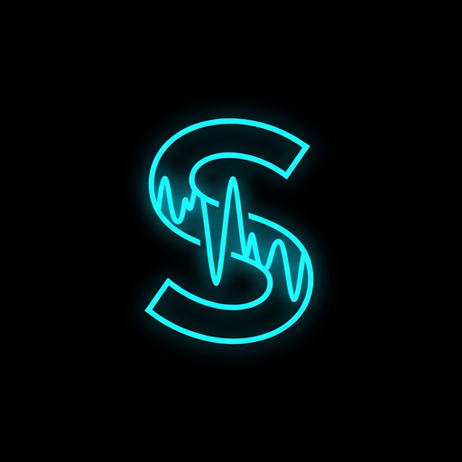

<p align="center">
  
</p>

# SONIX STUDIO - Professional Native Linux DAW

> **Languages / Språk:** [🇬🇧 English](README.md) | [🇸🇪 Svenska](README_SV.md)

A modern, lightning-fast graphical Digital Audio Workstation (DAW) built with **Rust** and **egui**, featuring FL Studio-style direct timeline audio editing, magnetic loop snapping, FL Studio/VST3/CLAP plugin **scanning & cataloguing**, Soundtrap-style creative panels, an integrated modular synthesizer, 16-step Channel Rack, Piano Roll, Vocal Studio with live microphone recording, a multichannel Effects Mixer, and Touch Instruments for Linux. Audio runs through the system's realtime backend via **cpal/ALSA** (PipeWire works through its ALSA layer). See **[Features & Implementation Status](#-features--implementation-status)** for exactly what is real today and what is still to come. Full development plan: **[ROADMAP.md](ROADMAP.md)**.

---

## 🚀 Installation (Linux / Omarchy)

Sonix is a native Linux DAW written in **Rust** and **egui**. You run it by building from source with Cargo. The built-in mode that captures the 29 screenshots is only used by maintainers (see the note under the gallery below) and is **not** part of installing or running the app.

> 📦 **Prebuilt binary (no Rust needed):**
> Grab the latest `sonix-<version>-x86_64-unknown-linux-gnu.tar.gz` from the [Releases page](https://github.com/alexwest1981/sonix/releases/latest), unpack it and run `./sonix`. The archive ships the binary, both READMEs, the manual, the changelog and the licenses, plus a `.sha256` checksum. It is built with `--features plugin-host` for x86-64 (glibc ≥ 2.35).

> 🐧 **Flatpak:** Sonix is packaged in the [omapak](https://omapak.org/app/io.github.alexwest1981.sonix) catalog. That build repacks the same x86-64 release tarball, so it is the same binary with the app's config and library inside the sandbox (`~/.var/app/io.github.alexwest1981.sonix/`).

> ⚡ **Fastest way (guided installer):**
> Download and run `install.sh` – it confirms every step for you (dependencies, compilation, binary + start-menu entry) with no other terminal commands needed:
> ```bash
> bash <(curl -fsSL https://raw.githubusercontent.com/alexwest1981/sonix/master/install.sh)
> ```
> If you already have a clone, just run `bash install.sh` from inside the folder. After a code change you can refresh the binary + start-menu entry with `bash install.sh --refresh`.
>
> The installer asks which interface language you want (English, Svenska, Dansk, Norsk, Deutsch, Español, Français). You can always switch languages live from the **🌐 menu** in the app's top toolbar — the choice is remembered between sessions.

### Prerequisites

- 64-bit Linux with a running audio server — **PipeWire** (recommended), **JACK** or **ALSA**.
- **Rust** (stable, edition 2024) plus a C toolchain.
- One runtime helper used by a specific feature: `unzip` (Suno ZIP import). Optional. File dialogs have come from the desktop's own portal since Fas 7.1 (`xdg-desktop-portal`, installed with most desktop environments) — `zenity` is no longer needed.
- Optional, for Windows VSTs: **yabridge** + **Wine**.

Install the prerequisites:

**Omarchy / Arch Linux:**

```bash
sudo pacman -S --needed base-devel alsa-lib unzip rustup
rustup default stable
```

**Debian / Ubuntu:**

```bash
sudo apt install build-essential libasound2-dev unzip curl
curl --proto '=https' --tlsv1.2 -sSf https://sh.rustup.rs | sh
```

**Fedora:**

```bash
sudo dnf install gcc-c++ alsa-lib-devel unzip curl
curl --proto '=https' --tlsv1.2 -sSf https://sh.rustup.rs | sh
```

### 1. Clone and build

```bash
git clone https://github.com/alexwest1981/sonix.git
cd sonix
cargo build --release
./target/release/sonix
```

During development you can skip the manual build step and use `cargo run --release` instead.

### 2. Install the binary (optional but recommended)

Installs `sonix` into `~/.cargo/bin` so you can launch it from anywhere or from an application menu:

```bash
cargo install --path .
sonix
```

### 3. Application menu entry (Omarchy / Linux desktop)

After `cargo install`, create a launcher (adjust the paths if your clone lives elsewhere):

```bash
mkdir -p ~/.local/share/applications
cat > ~/.local/share/applications/sonix.desktop <<EOF
[Desktop Entry]
Name=Sonix Studio
Comment=Native Linux DAW
Exec=$HOME/.cargo/bin/sonix
Icon=$HOME/Projects/sonix/assets/sonix.png
Terminal=false
Type=Application
Categories=Audio;AudioVideo;Music;
StartupWMClass=sonix-daw
EOF
```

Then log out/in once, or refresh the menu immediately with:

```bash
update-desktop-database ~/.local/share/applications
```

### Troubleshooting

- **No sound / no audio device:** make sure PipeWire (or JACK/ALSA) is running and your microphone/interface is connected. Open the audio settings in-app with **Ctrl + P** to pick a device and buffer size.
- **Window fails to open:** you need a working Wayland or X11 session with Mesa/OpenGL drivers.

---

## 🎧 Samples, stems and your own music

**The repository contains no audio files at all** — deliberately, in both directions:

- No third-party sample packs are shipped. Their licences don't allow redistribution.
- No stems or recordings of your own music are ever committed — `imported_stems/`,
  `*.wav`, `*.mp3`, `*.flac` and `*.ogg` are in `.gitignore`.
- A guard rejects any staged file over 5 MB (`git config core.hooksPath .githooks` once per
  clone — that is why the 416 MB of audio that once ended up in this repo's history cannot
  happen again by accident).

**The app is fully playable without any of it.** The drum voices (kick, snare, clap, hats,
crash) are synthesised, so the Channel Rack, the sequencer and the demo song work out of the
box. Samples are an upgrade, not a requirement.

### Where sounds go

| What | Where |
|---|---|
| Sample packs — the library the Sound Browser scans | `~/Music/Sonix/Sample_Packs/` |
| Factory sounds | `~/Music/Sonix/Factory_Samples/` |
| Your own samples | `~/Music/Sonix/Samples/` |
| Imported stems and recordings (gitignored) | `imported_stems/` in the project folder |
| Templates | `~/Music/Sonix/Templates/` |

Every path can be moved. Run `sonix --paths` to see the map your machine actually uses — it
also prints which directories exist and which would be created.

### Where to get packs

Free, licensed starting points: **Freesound** (CC — check each file), **99Sounds**,
**Bedroom Producers Blog** and **Cymatics**' free packs. Paid subscriptions such as
**Splice** or **Loopcloud** drop straight into `Sample_Packs/` as well. Check a pack's
licence before releasing music made with it.

### Naming — how the drum rack finds your samples

When the library is scanned, the six built-in drum channels fill themselves from the first
file whose name contains one of these words:

| Channel | Matches on |
|---|---|
| Kick | `kick`, `bass drum`, `bd0`, `bd-` |
| Snare | `snare` |
| Clap | `clap`, `handclap` |
| Closed hi-hat | `closed hat`, `chh`, `hat closed` |
| Open hi-hat | `open hat`, `ohh`, `hat open` |
| Crash | `crash`, `cymbal`, `cy` |

Name files accordingly (`909 kick.wav`, `snare_tight.wav`) and they land in the right channel
on the next start. Everything else still appears in the Sound Browser.

## 🎨 Features & Implementation Status

**Legend:** ✅ Real & wired · 🟡 Partial / approximation · 🔜 Not yet implemented

> Everything marked ✅ is genuinely functional in the audio engine or project state — not a mock-up. The 🟡 items work but are deliberately labelled so nothing is over-sold. Per-feature detail lives in **[MANUAL.md](MANUAL.md)**; the built-in effects catalogue is in **[PLUGINS.md](PLUGINS.md)**.

### 1. 🎼 Timeline & Multitrack Arranger — ✅ Real
* **Direct Clip Edge Dragging (Paint & Select Tools):** Grab the right edge to extend and loop clips across bars, or drag left to shorten. Grab the left edge to trim/crop the start without destructive edits.

### 2. 🥁 Sonix Channel Rack (16-Step Sequencer) — ✅ Real
* **Channel Strips:** Kick, Snare, Closed/Open Hat, Synth Lead, Sub Bass and custom user channels.

### 3. 🎹 Piano Roll & Interactive Touch Keyboard — ✅ Real
* **Polyphonic Note Editor:** Note lengths, velocity editing, scale snapping and brush tools.

### 4. 🎚 Mixer Console & Per-Track Effects — ✅ Real
* **Channel Strips:** Faders, real peak VU meters, solo, mute, pan and stereo width.

### 5. 🎛 Analog Alchemy Synth — ✅ Real
* 4 waveforms (sine, saw, square, triangle), ADSR, resonant filter, drive and an 8-snapshot morph vector pad.
* 🟡 **Note:** The filter is a 2-pole (12 dB) state-variable low-pass — not a 24 dB Moog ladder.

### 6. 🎙 Vocal Studio & Harmonizer — ✅ Real
* **Take Lanes:** Multiple takes with non-destructive comping; waveform crop/slice/normalize.
* 🟡 **Note:** The graphical pitch editor and the harmony voices still run **offline** on the recorded buffer; the real-time auto-tune and direct monitoring are genuine. Pitch detection is autocorrelation-based.

### 7. 🎛 Creative Generators — ✅ Real
* **Smart Chord & Harmony Matrix:** 12 scales, Roman-numeral progressions, voicings, strum humanizer, arpeggiator → Piano Roll.

### 8. 🧩 Modular Patcher — 🟡 Real DSP, order-sensitive
* Visual node grid with patch cables: MidiIn, Oscillator (sine/saw/square/triangle + sync/PWM), Filter (LP/HP/BP), ADSR Envelope, LFO, Delay, Reverb, Distortion, AudioOut.
* 🟡 **Note:** Nodes are evaluated in creation order (no topological sort), so cables must follow signal order. A few node labels describe more than the DSP does.

### 9. 🤖 AI Music Assistant & Generation — ✅ Real (with honest limits)
* **Real HTTP integration:** OpenAI, Anthropic, OpenRouter and local Ollama for text→patterns; audio generation via OpenAI TTS and Stability Stable Audio. Project context (key/BPM/selection) is injected into prompts.
* 🟡 **Note:** There is **no** Suno API integration. "Suno" here means importing Suno-exported stem packs and using the local generator — not calling Suno.

### 10. 🧠 Stem Separator — ✅ Real (DSP + optional neural HTDemucs)
* Splits a mix into vocals/drums/bass/instruments. The default is a real spectral DSP separator (band-splitting, center-channel extraction, transient gating) with a real onset-autocorrelation BPM estimator.
* 🟡 **Note:** Sonix does not ship model weights; the neural path needs a user-provided, appropriately licensed model. The default build stays dependency-free and offline.

### 11. 🔌 Plugin Manager — 🟡 Catalogue + opt-in CLAP/VST3/VST2 host
* Real recursive scanning of VST3/CLAP/LV2/VST2/`.fst` folders, ELF/PE binary verification, Wine & yabridge detection, and a one-click `yabridgectl sync`.
* 🔜 **Note:** **VST3 and VST2** modules can now be loaded, inspected and **played** (opt-in `--features plugin-host`), just like CLAP. **LV2** is still catalogue-only. Plugin GUIs need a real X display (cannot be shown headless). See **[PLUGINS.md](PLUGINS.md#6-third-party-plugin-host)** for the full plugin support status.

### 12. 💿 Export & Project I/O — ✅ Real
* Offline render of the full project (real samples, timeline audio, FX) to **WAV** (16/24-bit & 32-bit float) and **FLAC** (in-app encoders); **MP3/OGG/AAC** via `ffmpeg` when installed.

### 13. 🎛 Hardware Control — ✅ Real
* Real ALSA MIDI (MCU-style) input and a real UDP OSC server; live device list and bound port are shown in-app.

### 14. 🌐 Localisation & System — ✅ Real
* **7 interface languages** (English, Svenska, Dansk, Norsk, Deutsch, Español, Français), switchable live and remembered between sessions.

---

## 🌐 What leaves the machine

Sonix is a local application. It asks for `--share=network` for exactly one optional feature: the **AI music assistant** (and its speech synthesis), which calls an endpoint **you** configure — OpenAI, Anthropic, OpenRouter, or a local Ollama / any OpenAI-compatible server on your own machine. The key is stored in Sonix's own config on your disk.

There is **no telemetry, no update check, no account and no analytics**, and nothing is sent anywhere unless you ask the assistant to run. Editing, mixing, stem separation, plugin scanning, autosave and export are entirely offline — the built-in DSP does not need a network.

When Sonix runs as a Flatpak (the [omapak](https://omapak.org/app/io.github.alexwest1981.sonix) package), that config — and the rest of Sonix's state — lives inside the sandbox, in `~/.var/app/io.github.alexwest1981.sonix/`.

---

## 📁 File Locations & Autosave

Every path is built in **one** place (`src/paths.rs`) and follows XDG. Run `sonix --paths` to print the map for your machine (✓ = exists, · = created on demand).

| Location | Contents |
| :--- | :--- |
| `~/Music/Sonix/` | The library (`XDG_MUSIC_DIR` is honoured, including via `~/.config/user-dirs.dirs`) |
| `~/Music/Sonix/Projects/` | `<name>.sonix` + `<name>/` with the project's own media (Recordings, Stems, Samples, Renders) |
| `~/Music/Sonix/Samples/` · `Factory_Samples/` · `Templates/` | Your samples, factory sounds, project templates |
| `~/.config/sonix/` | `config.json` (language), `audio.json` (stream), `ai.json` (keys, chmod 0600) |
| `~/.local/share/sonix/` | `models/` (ONNX), `plugins/` |
| `~/.local/state/sonix/` | `recent.json` (recent projects), `window.json`, `logs/` (audio-thread crash log), **`autosave/`** |
| `~/.cache/sonix/` | `waveforms/`, `library_cache.tsv` |

**Override with environment variables:** `SONIX_PROJECTS_DIR`, `SONIX_SAMPLES_DIR`, `SONIX_CONFIG_DIR`, `SONIX_DATA_DIR`, `SONIX_STATE_DIR`, `SONIX_CACHE_DIR` (otherwise `XDG_*` applies).

### Autosave & crash recovery

- The project is autosaved **every 60 seconds** if anything changed, and **immediately after structural edits** (cuts, tracks, mute, paste …) — rate-limited to one write per ten seconds.
- The **5 most recent versions per project** are kept in `~/.local/state/sonix/autosave/`; older ones are rotated out.
- Everything is written **atomically** (temp file + `rename`), so an interrupted write can never replace a whole project file with half of one.
- If Sonix starts and finds an autosave **newer than the project file on disk**, a recovery dialog is shown. A restored copy is *retired* (renamed to `*.restored`) rather than deleted.
- The project menu has **🕘 Recent projects** (reads `recent.json`) and **📂 Show project folder in file manager**.

Undo currently covers the timeline; undo for mixer/FX/automation is planned as item 6.2 in [ROADMAP.md](ROADMAP.md).

---

## 🧭 What's Left & How Far From "Real"

A candid status of the remaining gaps. The audio engine, timeline, mixer, generators and I/O are real; the items below are the honest exceptions.

| Area | Status | Remaining work |
| :--- | :--- | :--- |
| Audio engine (synth, drums, samples, FX, render) | ✅ Real | — |
| Timeline, Piano Roll, Channel Rack, Mixer | ✅ Real | — |
| Vocal Studio (record, comp, pitch edit, harmony) | ✅ Real | — |
| Generators (Chord, Dice, Drummer, Sections, Tuner) | ✅ Real | — |
| AI (LLM + audio APIs) | ✅ Real | Local fallback is rule-based, not a neural model |
| Hardware MIDI / OSC | ✅ Real | — |
| Export (WAV/FLAC in-app, MP3/OGG/AAC via ffmpeg) | ✅ Real | — |
| Modular Patcher | ✅ Real | Topological sort + labels match the DSP |
| Stem separation | ✅ Real | Optional neural HTDemucs via `--features neural` + user model; DSP fallback otherwise |
| Vocal tuning | ✅ Real | Real-time autotune in the audio thread + direct monitoring; harmonies/formant preservation run offline |
| Time-stretch | ✅ Real | WSOLA (pitch-preserving) in the Vocal Studio audition and the Stem Separator SPEED control |
| Audio Settings | ✅ Real | Live stream rebuild + persisted; shows real host/device/stream |
| Legacy "AI Settings" modal | ✅ Real | Now edits the same `AiConfig` and saves to disk |
| `.fst` "Apply Preset" button | ✅ Honest | Disabled with a tooltip — FL Studio's closed `.fst` preset data cannot be decoded; CLAP/VST2/VST3 plugins can be loaded from the plugin panel instead |
| Plugin hosting (VST3/CLAP/LV2/VST2) | 🟡 Partial | CLAP, **VST3 and VST2** load + parameter inspection + per-track audio processing with PDC + state save-load + CLAP GUI in its own X11 window + separate-process sandbox with crash restart **and shared-memory audio transport** (opt-in `--features plugin-host`); LV2, MIDI instrument routing & a real Wine/yabridge bridge still missing |

**Overall:** roughly **90–95 %** of the features advertised in the UI are genuinely implemented and wired to the audio engine; the honest exceptions are the rows marked 🟡 above.

The full, prioritised development plan with check-off phases lives in **[ROADMAP.md](ROADMAP.md)**. A complete catalogue of every built-in effect, channel processor and instrument — with what each one does and its controls — lives in **[PLUGINS.md](PLUGINS.md)**.

## 📸 Screenshots & UI Gallery (1920 × 1080 Fullscreen)

> ℹ️ These previews are generated by maintainers with `cargo run --release -- --capture-screenshots screenshots` (opens a fullscreen instance and captures each view). Not needed for installing or running Sonix.

### 1. 🎼 Main Workspaces & Production

#### 1. 🎼 Timeline & Multitrack Arranger (Playlist)
Linear multitrack editor with FL Studio-style clip dragging, magnetic loop snapping, continuous waveforms, tool palette, and live microphone track.


#### 2. 🥁 16-Step Channel Rack & Drum Sequencer
Tactile step buttons with glowing center LEDs, mute/solo status, dedicated volume/pan rotary knobs, and sample quick-select.


#### 3. 🎹 Piano Roll & Interactive Touch Keyboard
Polyphonic note editor with note lengths, velocity, scale snapping, and playable keyboard with neon visual feedback.


#### 4. 🎙 Vocal Studio & Microphone Recording (Take Lanes)
Professional recording console for vocals and acoustic instruments with pitch detection, offline autotune, formant-preserving pitch shift, and a 4-part harmonizer.


#### 5. 🎤 Vocal Studio: Custom Sound & Sampler Recording
Record acoustic instruments or custom samples directly from microphone and map them into synths and drum tracks.


#### 6. 🎚 Master & Multitrack Effects Mixer
Full mixing console with individual channel strips, VU meters, per-track 3-band parametric EQ, and reverb/delay sends.


---

> 🖼 **The remaining 23 views** — synthesizers, session drummer, modular patcher, remix FX, studio panels and every dialog — are in **[MANUAL.md](MANUAL.md)**.

## 📜 License

Sonix Studio is dual-licensed under either of

- MIT License ([LICENSE-MIT](LICENSE-MIT))
- Apache License, Version 2.0 ([LICENSE-APACHE](LICENSE-APACHE))

at your option. Unless you explicitly state otherwise, any contribution intentionally submitted for inclusion in this project by you, as defined in the Apache-2.0 license, shall be dual-licensed as above, without any additional terms or conditions.


