# 🍊 SONIX STUDIO - Professionell Linux DAW

> **Språk / Languages:** [🇸🇪 Svenska](README_SV.md) | [🇬🇧 English](README.md)

Ett modernt, blixtsnabbt grafiskt musikproduktionsprogram skapat i **Rust** och **egui** med FL Studio-inspirerad direkt redigering i tidslinjen, magnetisk loop-snäppning, skanning & katalogisering av FL Studio/VST3/CLAP-plugins, Soundtrap-inspirerade kreativa paneler, integrerad modulär synthesizer, 16-stegs Channel Rack, Piano Roll, Sångstudio med mikrofoninspelning i realtid, multikanals mixerbord och touch-instrument för Linux. Ljudet går genom systemets realtidsbackend via **cpal/ALSA** (PipeWire fungerar via sitt ALSA-lager). Se **[Funktioner & implementationsstatus](#-funktioner--implementationsstatus)** för exakt vad som är äkta idag och vad som återstår. Fullständig utvecklingsplan: **[ROADMAP.md](ROADMAP.md)**.

---

## 🚀 Installation (Linux / Omarchy)

Sonix är en inhemsk Linux-DAW skriven i **Rust** och **egui**. Du kör den genom att kompilera från källkod med Cargo. Det inbyggda läget som tar de 29 skärmdumparna används bara av underhållarna (se notisen under galleriet nedan) och är **inte** en del av att installera eller köra programmet.

> ⚡ **Snabbaste sättet (guidad installerare):**
> Ladda ner och kör `install.sh` – den bekräftar varje steg åt dig (beroenden, kompilering, binär + startmenypost) och kräver inga terminalkommandon utöver:
> ```bash
> bash <(curl -fsSL https://raw.githubusercontent.com/alexwest1981/sonix/master/install.sh)
> ```
> Har du redan en klon kör du bara `bash install.sh` inifrån mappen. Efter en kodändring kan du uppdatera binär + startmenypost med `bash install.sh --refresh`.

### Förutsättningar

- 64-bitars Linux med en ljudserver i gång — **PipeWire** (rekommenderas), **JACK** eller **ALSA**.
- **Rust** (stable, edition 2024) plus en C-kompilator.
- Ett par körtidsverktyg som används av vissa funktioner: `zenity` (fildialoger) och `unzip` (Suno ZIP-import). Båda valfria.
- Valfritt, för Windows-VST: **yabridge** + **Wine**.

Installera förutsättningarna:

**Omarchy / Arch Linux:**

```bash
sudo pacman -S --needed base-devel alsa-lib zenity unzip rustup
rustup default stable
```

**Debian / Ubuntu:**

```bash
sudo apt install build-essential libasound2-dev zenity unzip curl
curl --proto '=https' --tlsv1.2 -sSf https://sh.rustup.rs | sh
```

**Fedora:**

```bash
sudo dnf install gcc-c++ alsa-lib-devel zenity unzip curl
curl --proto '=https' --tlsv1.2 -sSf https://sh.rustup.rs | sh
```

### 1. Klona och kompilera

```bash
git clone https://github.com/alexwest1981/sonix.git
cd sonix
cargo build --release
./target/release/sonix
```

Under utveckling kan du hoppa över det manuella byggsteget och använda `cargo run --release` i stället.

### 2. Installera binären (valfritt men rekommenderat)

Installerar `sonix` i `~/.cargo/bin` så att du kan starta programmet var som helst ifrån eller från en applikationsmeny:

```bash
cargo install --path .
sonix
```

### 3. Menypost i applikationsmenyn (Omarchy / Linux desktop)

Skapa efter `cargo install` en startare (justera sökvägarna om din klon ligger på annan plats):

```bash
mkdir -p ~/.local/share/applications
cat > ~/.local/share/applications/sonix.desktop <<EOF
[Desktop Entry]
Name=Sonix Studio
Comment=Native Linux DAW
Exec=$HOME/.cargo/bin/sonix
Icon=$HOME/Projects/sonix/assets/sonix.png
Terminal=false
Type=Application
Categories=Audio;AudioVideo;Music;
StartupWMClass=sonix-daw
EOF
```

Logga sedan ut/in en gång, eller uppdatera menyn direkt med:

```bash
update-desktop-database ~/.local/share/applications
```

### Felsökning

- **Inget ljud / ingen ljudenhet:** kontrollera att PipeWire (eller JACK/ALSA) är i gång och att din mikrofon/audiointerface är anslutet. Öppna ljudinställningarna i programmet med **Ctrl + P** för att välja enhet och buffertstorlek.
- **Fönstret startar inte:** du behöver en fungerande Wayland- eller X11-session med Mesa/OpenGL-drivrutiner.

---

## 🎨 Funktioner & Implementationsstatus

**Teckenförklaring:** ✅ Äkta & inkopplad · 🟡 Delvis / approximation · 🔜 Ännu inte implementerad

> Allt som är markerat ✅ fungerar på riktigt i ljudmotorn eller projektets tillstånd — inte en mock-up. 🟡-punkterna fungerar men är medvetet märkta så att inget överlövas.

### 1. 🎼 Tidslinje & Flerspårs-Arranger — ✅ Äkta
* **Dra direkt i klippkanter (Paint & Select):** Förläng/loopa klipp sömlöst över takter, korta av, eller trimma vänsterkanten utan destruktiva ingrepp.
* **Kontinuerlig vågformsfasning:** Starttrim flyttar vågformen naturligt utan att förvränga loopcykler.
* **Magnetisk Loop-Snap (🧲):** Låser mot multiplar av hela looplängder (`1x`–`8x`) och rutnät (`1/16`, `Beat`, `Bar`). Håll `Alt` för fri precision.
* **Nedre Region-Inspektor:** Grov/fin nudge (`±1 takt`, `±0.1s`), starttrim-offset, gain, fade in/out, reverse och loop-multiplikator.
* **Verktygspalett:** Välj (⇱), Rita (✎), Klipp (✂), Radera (🗑), Muta (🔇); snabbklipp vid spelhuvudet (Ctrl+B).
* **Direkt mikrofoninspelning i spår:** Armeringsknapp (`⏺`), riktig noll-latens direktlyssning och realtidsvågformer.
* **Automationskurvor (📈):** Rita kurvor per spår för volym, panorering, reverb- och delay-send. Vänsterklicka för punkter, dra för att flytta (snäpps mot rutnätet), högerklicka för att ta bort. Kurvorna spelas upp i realtid och sparas i projektet.

### 2. 🥁 Sonix Channel Rack (16-Stegs Sequencer) — ✅ Äkta
* **Kanalstrippar:** Kick, Snare, Closed/Open Hat, Synth Lead, Sub Bass och egna kanaler.
* **4-Takts Stegknappar** med lysande center-LEDs.
* **Kanalrattar:** Volym, panorering, pitch (semitones + cents) och en **sample-chopper** (start/slut-fraktioner + transientdetektering).

### 3. 🎹 Piano Roll & Interaktivt Touch-Klaviatur — ✅ Äkta
* **Polyfonisk Noteditor:** Notlängder, velocity, skalsnäppning och penselverktyg.
* **Spelbart Virtuellt Klaviatur:** Neonfeedback med stöd för datortangentbord (A–K).
* **Riktig MIDI-klaviaturingång (ALSA Seq):** Öppna en riktig MIDI-in-port ("Sonix MIDI In"), koppla ett hårdvaruklaviatur med `aconnect`, spela live och armera **⏺ MIDI-REC** för att skriva hållna toner direkt i Piano Roll-rutnätet under uppspelning.

### 4. 🎚 Mixerbord & Per-Spår-Effekter — ✅ Äkta
* **Kanalstrippar:** Faders, riktiga peak-VU-mätare, solo, mute, pan och stereobredd.
* **Per-Spår 3-Bands Parametrisk EQ:** Dragbar visuell kurva + snabbpresets.
* **Per-Spår Dynamik & Sends:** Kompressor, reverb/delay-sends och pitch — allt skickas till ljudmotorn.
* **Master FX Rack:** Gate → 4-bands EQ → kompressor → de-esser → filter/drive → doubler → limiter, plus reverb & delay, med **riktig gain-reduction-mätare** och visuell EQ-redigerare.
* **Remix FX (live):** Kaoss-liknande XY-platta med beat-repeat/stutter/reverse och en riktig tape-stop-varispeed.
* 🟡 **Not:** VCA-grupper och sub-mix-bussar är **inte** implementerade (de gamla döda reglagen togs bort).

### 5. 🎛 Analog Alchemy Synth — ✅ Äkta
* 4 vågformer (sinus, sågtand, fyrkant, triangel), ADSR, resonant filter, drive och en morph-vektorplatta med 8 snapshots.
* ✅ **Per röst:** Varje ton har eget filtertillstånd och eget filter-envelope (ratten **ENV ±oct** sveper cutoff per ton); envelope-parametrarna är patch-globala så rattar hörs live.
* 🟡 **Not:** Filtret är ett 2-poligt (12 dB) state-variable lågpass — inte ett 24 dB Moog-ladder.

### 6. 🎙 Sångstudio & Harmonizer — ✅ Äkta
* **Take Lanes:** Flera tagningar med icke-destruktiv comping; vågform crop/slice/normalize.
* **Pitch-editor:** Dragbara not-blobs (Melodyne-liknande) och skalanpassad korrigering.
* **Autotune & 4-stämmig Harmonizer** med nivå och formant per stämma; stämmorna använder **riktig formantbevarning** (STFT + cepstral envelop-korrigering) så pitch-shift inte längre låter "chipmunk".
* **Realtids-Auto-Tune & direktlyssning:** Kryssrutan 🎙️ Realtids-Auto-Tune korrigerar mikrofonen i ljudtråden (rullande pitchdetektering + WSOLA-streaming-shifter) och hörs via riktig noll-latens direktlyssning (ring-buffert → master-bussen). Styrka = AUTO-TUNE-ratten. Inspelning sker torrt.
* **Egen Sampler:** Spela in akustiska one-shots via mikrofon och mappa till instrument/trummor.
* **Hårdvaru-mikpanel:** Enhetsväljare, hårdvarugain (+0 till +24 dB), brusgrind, återkopplingsdämpning och röstpresets.
* 🟡 **Not:** Den grafiska pitch-editorn och harmonierna körs **offline** på den inspelade bufferten; realtids-autotunen och direktlyssningen är äkta men harmonistämmorna renderas fortfarande offline. Pitchdetektering är autokorrelationsbaserad.

### 7. 🎛 Kreativa Generatorer — ✅ Äkta
* **Smart Ackord- & Harmonimatris:** 12 skalor, romerska siffror, voicings, strum-humanisering, arpeggiator → Piano Roll.
* **Beat- & Meloditärning:** 5 kategorier, genrepresets, live-förhandsvisning → mönster.
* **Session Drummer:** XY-platta för komplexitet/energi med 6 genrepresets.
* **Låtstruktur-Arrangör:** Intro/Vers/Refräng/Stick/Drop/Outro → tidslinjen.
* **Spårskapare:** 19 mallar i 6 kategorier.
* **Hårdvaru-Strobetuner:** Riktig pitchdetektering, ±cents, 7 stämningspresets och en referenston.

### 8. 🧩 Modulär Patcher — 🟡 Äkta DSP, ordningskänslig
* Visuellt nodnät med patchkablar: MidiIn, Oscillator (sinus/sågtand/fyrkant/triangel + sync/PWM), Filter (LP/HP/BP), ADSR, LFO, Delay, Reverb, Distortion, AudioOut.
* 🟡 **Not:** Noderna utvärderas i skapandeordning (ingen topologisk sortering), så kablar måste följa signalordningen. Några nodetiketter lovar mer än DSP:n gör.

### 9. 🤖 AI Musikassistent & Generering — ✅ Äkta (med ärliga gränser)
* **Riktig HTTP-integration:** OpenAI, Anthropic, OpenRouter och lokal Ollama för text→mönster; ljudgenerering via OpenAI TTS och Stability Stable Audio. Projektkontext (tonart/BPM/val) injiceras i prompten.
* **Lokal fallback:** en deterministisk, regelbaserad kompositör (skala/tonart) när inget API är konfigurerat.
* **Suno/AI Stem-importör:** Packa upp och avkoda riktigt ljud, detektera BPM och mappa stämmor till tidslinjen.
* 🟡 **Not:** Det finns **ingen** Suno-API-integration. "Suno" betyder här import av Suno-exporterade stämpaket och den lokala generatorn — inte anrop till Suno.

### 10. 🧠 Stem Separator — ✅ Äkta (DSP + valfri neural HTDemucs)
* Delar en mix i sång/trummor/bas/instrument. Standard: en riktig spektral-DSP-separator (banddelning, centerkanal-extraktion, transient-gating) med en riktig BPM-skattning via autokorrelation.
* **Valfri neural backend:** bygg med `--features neural` och lägg en HTDemucs-familj `.onnx`-modell i `~/.config/sonix/models/` (eller sätt `SONIX_DEMUCS_ONNX`) för äkta Demucs-separation via ONNX Runtime — bakgrundstråd, live-progress, 44,1 kHz-resampling och överlappande crossfade. Utan modell används DSP-vägen och UI:t visar vilken backend som kördes.
* 🟡 **Not:** Sonix skeppar inga modellvikter; den neurala vägen kräver en egen, korrekt licensierad modell. Standardbygget förblir dependency-fritt och offline.

### 11. 🔌 Plugin-hanterare — 🟡 Katalog + opt-in CLAP-värd
* Riktig rekursiv skanning av VST3/CLAP/LV2/VST2/`.fst`-mappar, ELF/PE-verifiering, Wine- & yabridge-detektion och en ett-klicks `yabridgectl sync`.
* **Opt-in CLAP-värd:** bygg med `--features plugin-host` och Sonix kan `dlopen`:a en `.clap`-plugin, validera dess `clap_entry`, instansiera den, läsa dess **descriptor + parametrar** (knappen "🔎 Ladda & inspektera" visar dem), **köra ljud genom den på ett stämspår** med delay-kompensation (knappen "▶ Ladda in" sätter den som insert) samt **spara/ladda plugin-state i projektet och applicera pluginens egna presets** (`clap.state` + `clap.preset-load/2`). Projektet lagrar plugin-inserts per spår och återställer dem vid inladdning; UI:t listar aktiva inserts med en "🗑 Ta bort"-knapp och ett "Native preset (sökväg)"-fält.
* **Plugin-GUI i eget fönster:** en aktiv insert kan öppnas i pluginens eget gränssnitt med **"🪟 Öppna GUI"** — värden skapar ett riktigt **X11-fönster** och bäddar in editorn via `clap.gui` (`set_parent`/`show`), och ljudet och GUI:t delar **samma plugin-instans**. Fönstret pollas varje UI-frame och stängs rent (hide → destroy) när du stänger det.
* **Kraschisolering i separat process:** **"🧪 Sandbox-inspektera"** kör pluginen i en egen process (samma binär med `--plugin-sandbox-worker`) och läser dess info + parametrar där; en supervisor **startar om den automatiskt vid krasch** (upp till tre försök) så att Sonix inte stänger. **"🧪 Ladda in i sandbox"** går ett steg längre: **själva ljudprocessningen** körs i den separata processen och strömmar stereoblock över en **ringbuffert i delat minne** (`memfd_create` + `mmap`), där transportens ena blocks latens kompenseras av PDC och ringen re-synkas automatiskt efter en omstart.
* 🔜 **Not:** VST3/LV2/VST2 är fortfarande endast katalog. CLAP-GUI:t kräver en riktig X-display (kan inte visas headless). Se **[Plugin-stöd — nuläget](#-plugin-stöd--nuläget)**.

### 12. 💿 Export & Projekt-I/O — ✅ Äkta
* Offline-rendering av hela projektet (riktiga samples, tidslinje-audio, FX) till **WAV** (16/24-bit & 32-bit float) och **FLAC** (kodas i appen); **MP3/OGG/AAC** via `ffmpeg` om installerat.
* Ren metadatataggning (endast Sonix Studio), mastermix eller per-spår-stems.
* **Loudness-normalisering (EBU R128):** Äkta ITU-R BS.1770-grindad loudness (K-viktning) och äkta-peak-tak via 4× oversampling. Export-presets i ett klick (Streaming −14, Apple Music −16, Broadcast −23, Klubb/Loud −9 LUFS).
* Projekt spara/ladda och projektmallar.

### 13. 🎛 Hårdvarukontroll — ✅ Äkta
* Riktig ALSA MIDI (MCU-liknande) ingång och en riktig UDP OSC-server; enhetslista och bunden port visas i appen.

### 14. 🌐 Lokalisering & System — ✅ Äkta
* **7 gränssnittsspråk** (English, Svenska, Dansk, Norsk, Deutsch, Español, Français), växlingsbara live och ihågkomna mellan sessioner.
* **cpal/ALSA-realtidsmotor** med låsningsfri kommandoring och en kraschsäker ljudcallback.
* **Ljudinställningar** (Ctrl+P) applicerar vald samplingsfrekvens och buffertstorlek genom att bygga om ljudströmmen live; valet sparas till `~/.config/sonix/audio.json` och återställs vid start. Aktuell värd/enhet och den verkliga strömkonfigurationen visas.

---

## 🧭 Vad som är kvar & hur långt ifrån "äkta"

En ärlig status över kvarvarande luckor. Ljudmotorn, tidslinjen, mixern, generatorerna och I/O är äkta; punkterna nedan är de ärliga undantagen.

| Område | Status | Kvarvarande arbete |
| :--- | :--- | :--- |
| Ljudmotor (synth, trummor, samples, FX, render) | ✅ Äkta | — |
| Tidslinje, Piano Roll, Channel Rack, Mixer | ✅ Äkta | — |
| Sångstudio (inspelning, comping, pitch-edit, harmonier) | ✅ Äkta | — |
| Generatorer (Ackord, Tärning, Drummer, Sektioner, Tuner) | ✅ Äkta | — |
| AI (LLM + ljud-API:er) | ✅ Äkta | Lokal fallback är regelbaserad, inte en neural modell |
| Hårdvara MIDI / OSC | ✅ Äkta | — |
| Export (WAV/FLAC i appen, MP3/OGG/AAC via ffmpeg) | ✅ Äkta | — |
| Modulär Patcher | ✅ Äkta | Topologisk sortering + etiketter matchar DSP:n |
| Stem-separation | ✅ Äkta | Valfri neural HTDemucs via `--features neural` + egen modell; DSP-fallback annars |
| Vocal tuning | ✅ Äkta | Realtids-autotune i ljudtråden + direktlyssning; harmonier/formantbevaring körs offline |
| Time-stretch | ✅ Riktig | WSOLA (pitch-bevarande) i Sångstudiens provspelning och Stem Separators SPEED-ratt |
| Ljudinställningar | ✅ Äkta | Live-ombyggnad av strömmen + sparas; visar verklig värd/enhet/ström |
| Legacy-modal "AI-inställningar" | ✅ Äkta | Redigerar samma `AiConfig` och sparar till disk |
| `.fst`-knappen "Apply Preset" | ✅ Ärlig | Inaktiverad med förklaring — applicering kräver plugin-värd |
| Plugin-hosting (VST3/CLAP/LV2/VST2) | 🟡 Delvis | CLAP-laddning + parameterinspektion + per-spår-ljudprocessning med PDC + state/preset-sparning + GUI i eget X11-fönster + separat-process-sandbox med krasch/omstart **och delat-minne-ljudtransport** (opt-in `--features plugin-host`); MIDI-instrument-routing & Wine/yabridge saknas ännu |

**Helhetsbedömning:** ungefär **90–95 %** av funktionerna som utlovas i gränssnittet är genuint implementerade och inkopplade i ljudmotorn. Den största kvarvarande delen är **plugin-hosting** (CLAP-laddning + parameterinspektion + per-spår-ljudprocessning med PDC + state/preset-sparning + GUI i eget X11-fönster + separat-process-sandbox med krasch/omstart och delat-minne-ljudtransport fungerar opt-in; MIDI-instrument-routing och Wine/yabridge återstår); neural stem-separation är byggd (opt-in `--features neural` + en egen HTDemucs-ONNX).

Den fullständiga, prioriterade utvecklingsplanen med avbockningsbara faser finns i **[ROADMAP.md](ROADMAP.md)**.

---

## 🔌 Plugin-stöd — nuläget

> **Kort svar: katalog + opt-in CLAP-laddning, inspektion, per-spår-ljudprocessning, projektlagrad state/preset, plugin-GUI i eget X11-fönster och en out-of-process-sandbox med krasch/omstart och delat-minne-ljudtransport.** Sonix kan *hitta och katalogisera* alla format och — när det byggs med `--features plugin-host` — *ladda* en native CLAP-plugin, läsa dess parametrar, **köra ljud genom den på ett stämspår** med delay-kompensation, **spara/återställa dess state med projektet**, **ladda pluginens egna presets**, **öppna pluginens eget gränssnitt i ett X11-fönster som delar samma instans som processar ljudet**, **köra pluginens ljudprocessning i en separat process över delat minne** samt **starta om den automatiskt vid krasch**. MIDI-instrument-hosting och Wine/yabridge-vägen återstår.

**Vad som fungerar idag (✅)**
* Rekursiv skanning av standardmapparna för **VST3 / CLAP / LV2 / VST2** samt FL Studio-`.fst`-platser (Linux- och Wine-sökvägar).
* Binärverifiering (ELF/PE), filstorlek och en "verifierad"-markering.
* Detektion av Wine och `yabridgectl`, samt en ett-klicks `yabridgectl sync`.
* **CLAP-värd (opt-in, `--features plugin-host`):** `dlopen` av ett `.clap`-paket, validering av `clap_entry`, instansiering via plugin-fabriken och descriptor- + parameterinspektion som visas i UI:t.
* **Riktig ljudprocessning + PDC:** en laddad CLAP-effekt kan sättas som per-spår-insert (knappen "▶ Ladda in" i Plugin-hanteraren) och processar stämspårets ljud i realtid. Värden blockbuffrar (128 frames) och motorn kompenserar latensen så att spåren förblir faslinjerade.
* **State- + preset-persistens:** värden implementerar `clap.state` (opak save/load-blob) och `clap.preset-load/2` (pluginens egna presets). Plugin-inserts sparas i projektet (`plugin_slots`, sökväg + state) och återinstansieras med återställt state vid inladdning; UI:t listar aktiva inserts med en ta-bort-knapp och erbjuder ett "ladda med preset"-fält.
* **GUI-ABI + livscykel:** värden läser `clap.gui` och driver hela livscykeln på huvudtråden (`is_api_supported`, `get_preferred_api`, `create`, `get_size`, `can_resize`, `set_size`, `set_parent`, `show`, `hide`, `destroy`). Inspektionen visar pluginens GUI-kapacitet (t.ex. "x11 320×240, kan ändra storlek").
* **Plugin-GUI i eget X11-fönster:** en aktiv insert öppnas med **"🪟 Öppna GUI"**; värden skapar ett X11-fönster via `libX11` och bäddar in editorn med `set_parent`, och GUI:t delar **samma `ClapCore`-instans** som ljudtråden (via `Arc` + `PluginHandle`). Fönsterhändelser pollas varje UI-frame och stängning river editorn rent (hide → destroy). Kräver en riktig X-display.
* **Out-of-process sandbox (krasch/omstart + delat-minne-ljud):** **"🧪 Sandbox-inspektera"** kör pluginen i en **separat process** (samma binär re-exekverad med `--plugin-sandbox-worker`) över ett längdprefixat JSON-protokoll och läser dess info + parametrar där. En supervisor övervakar processen och **startar automatiskt om den vid krasch** (upp till tre försök) innan den ger upp, så att en kraschande plugin inte tar ner Sonix. **"🧪 Ladda in i sandbox"** flyttar dessutom **själva ljudprocessningen** till den processen: värd och arbetare mappar samma anonyma region (`memfd_create` + `mmap(MAP_SHARED)`) och utbyter stereoblock via SPSC-ringbuffertar, där transportens ena blocks latens kompenseras av PDC och ringen re-synkas efter en omstart.

**Vad som fortfarande saknas för full plugin-hosting (🔜)**
1. Full MIDI-routing in i instrument (note-port-upptäckt och plumbing finns, men ingen instrument-hosting ännu).
2. Wine/yabridge-vägen för FL Studio & Windows-VST (Fas 4.6).
3. VST3 / LV2 / VST2-laddning — endast CLAP är implementerat så långt.
4. För FL Studios egna instrument (Sytrus, Harmor, Gross Beat, …) och FL Studio VSTi är den enda farbara vägen deras **VST/VST3-byggen körda genom Wine + yabridge** — de nativa FL-`.dll`-formaten är inte ett standard-plugin-API.

**Därför:** en CLAP-**effekt** är nu användbar för ljud i Sonix när den byggs med `--features plugin-host` — ladda den, sätt den som insert på ett stämspår med "▶ Ladda in", öppna dess GUI med "🪟 Öppna GUI", och dess state överlever projektets spara/ladda. Kraschisolering via en separat process med **delat-minne-ljud** finns nu (med automatisk omstart); instrument-hosting och Wine/yabridge-vägen återstår.

---

## ⌨️ Tangentbords- & Snabbkommandoreferens

| Tangent / Genväg | Funktion | Beskrivning |
| :--- | :--- | :--- |
| **Mellanslag (Space)** | **Play / Pause** | Startar eller pausar uppspelningen i låt- eller mönsterläge. |
| **R** | **Record Arm** | Armera aktivt mikrofonspår för direktinspelning. |
| **Alt (Håll ned)** | **Fri Trim / Slip** | Förbikoppla magnetisk loop- och rutnätssnäppning för fri redigering. |
| **F1** | **Bruksanvisning / Manual** | Öppnar den inbyggda manualen och snabbguiden. |
| **F3** | **Tidslinje / Arranger** | Växlar till den linjära flerspårs-audiotidslinjen. |
| **F4** | **Channel Rack** | Växlar till 16-stegs trummaskinen och mönstereditorn. |
| **F5** | **Piano Roll** | Växlar till det grafiska notinmatningsfönstret. |
| **F6** | **Mixer Console** | Växlar till flerspårs-mixern och effektracken. |
| **F7** | **Analog Synthesizer** | Växlar till synteditorn med ADSR, Filter och Morph. |
| **F8** | **Vocal Studio** | Växlar till sångstudion, inspelning och harmonizern. |
| **Ctrl + I** | **Importera Stämmor** | Öppnar dialogen för att importera Suno- eller ljudfiler. |
| **Ctrl + E** | **Exportera Master / Stems** | Offline-renderar hela projektet (riktiga samples, tidslinje-audio & FX) till WAV, FLAC, MP3, OGG eller AAC med ren Sonix-metadata. |
| **Ctrl + S** | **Spara Projekt** | Sparar det aktuella projektet. |
| **Ctrl + O** | **Öppna Projekt** | Öppnar ett sparat projekt från disk. |
| **Ctrl + P** | **Ljudinställningar** | Öppnar konfiguration för PipeWire, ALSA och buffertstorlek. |

---

## 📸 Skärmdumpar & Gränssnitt (Galleri 1920 × 1200 Helskärm)

> ℹ️ Dessa förhandsvisningar genereras av underhållarna med `cargo run --release -- --capture-screenshots screenshots` (öppnar en helskärmsinstans och tar skärmdumpar av varje vy). Krävs inte för att installera eller köra Sonix.

### 1. 🎼 Huvudarbetsytor & Produktion

#### 1. 🎼 Tidslinje & Flerspårs-Arranger (Playlist)
Linjär flerspårsredigerare med FL Studio-liknande klippdragning, magnetisk loop-snäppning, kontinuerliga vågformer, verktygspalett och direkt mikrofoninspelning.
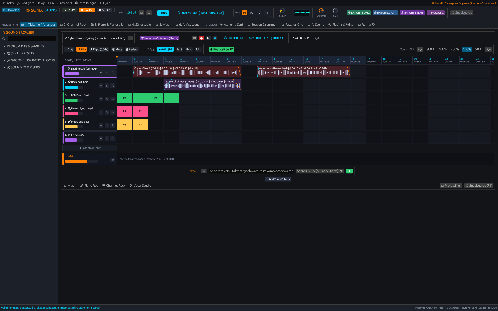

#### 2. 🥁 16-Stegs Channel Rack & Trummaskin
Taktila steg-knappar med vita center-LEDs, mute/solo-status, dedikerade rotary-rattar för volym och panorering per kanal samt snabbval av samplingar.
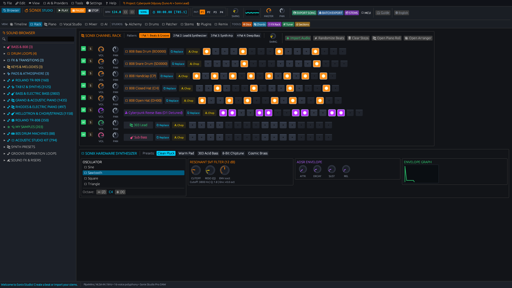

#### 3. 🎹 Piano Roll & Interaktivt Touch-Klaviatur
Polyfonisk noteditor med notlängder, anslagsdynamik (velocity), skalsnäppning samt spelbart klaviatur med neonvisuell feedback.
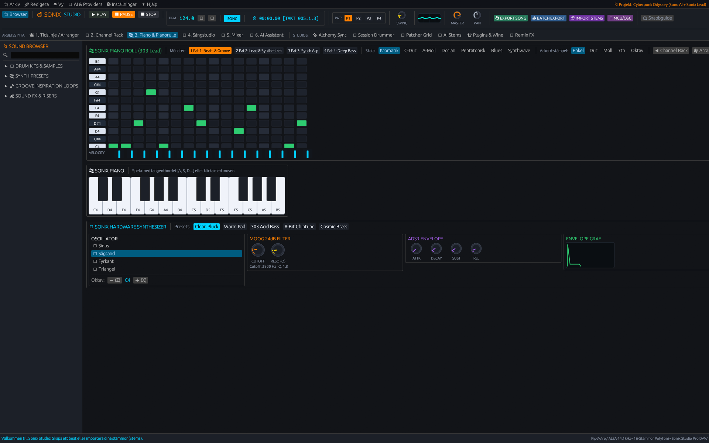

#### 4. 🎙 Sångstudio & Mikrofoninspelning (Take Lanes)
Professionell inspelningskonsol för sång och akustiska instrument med pitchdetektering, offline-autotune, formantbevarande pitch-shift och en 4-stämmig harmoniserare.
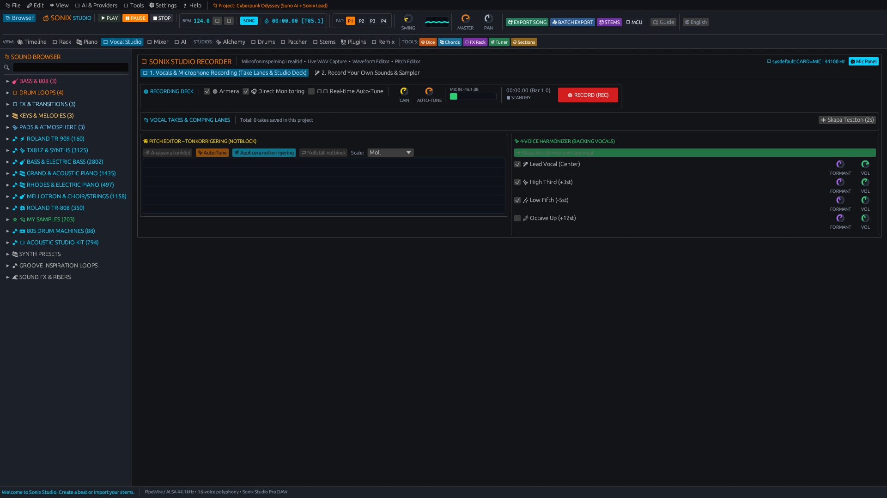

#### 5. 🎤 Sångstudio: Spela in Egna Ljud & Sampler
Spela in egna akustiska instrument eller samplingar direkt från mikrofon och mappa om dem till syntar och trumspår.
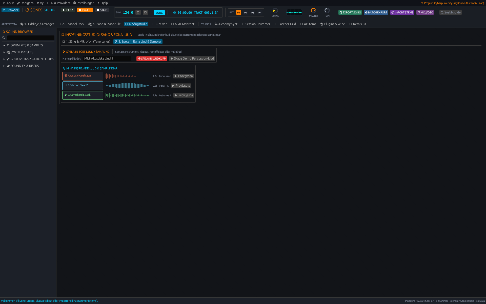

#### 6. 🎚 Master & Flerspårs Effects Mixer
Fullt mixerbord med individuella kanalstrippar, VU-mätare, per-spår 3-bands parametrisk EQ och rumsreverb/delay sends.
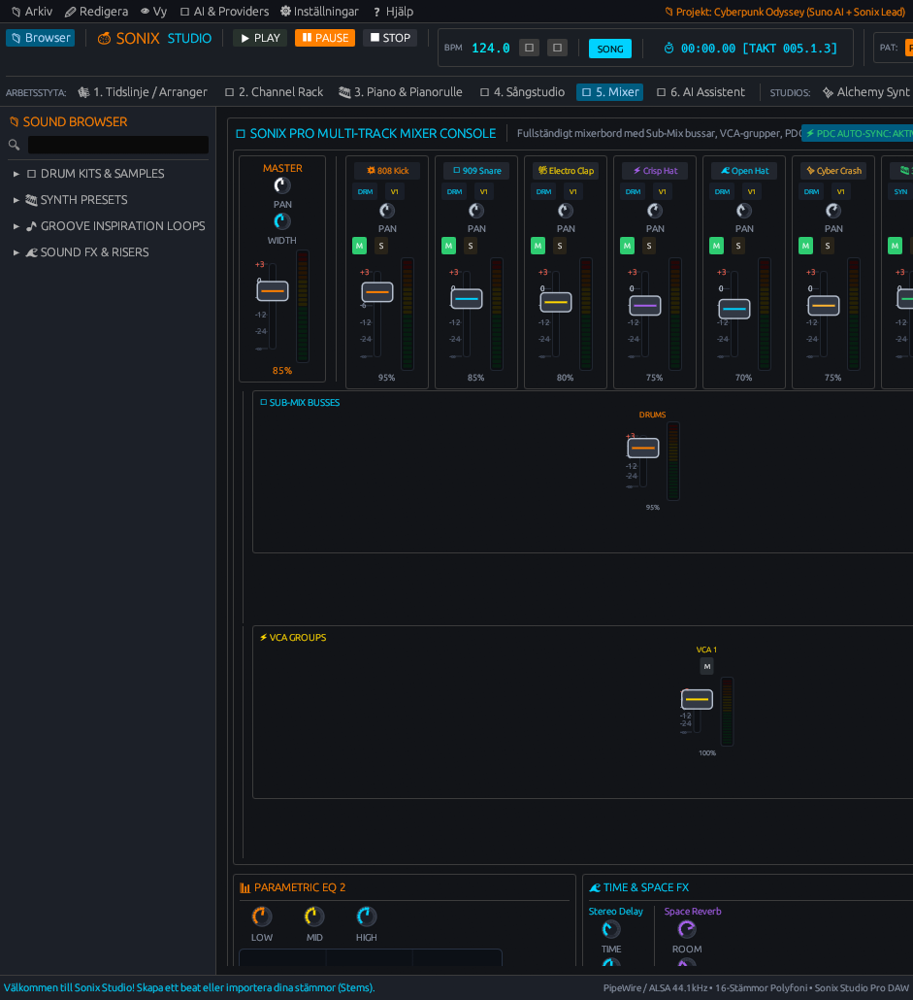

---

### 2. 🎛️ Syntar, AI-Moduler & Signalbehandling

#### 7. 🤖 AI Music Assistant & Prompt Engine
Skapa ackordföljder, melodier, basgångar och strukturidéer via naturlig textprompt (OpenAI, Anthropic/Claude, OpenRouter eller lokal Ollama), med en inbyggd regelbaserad generator som fallback.
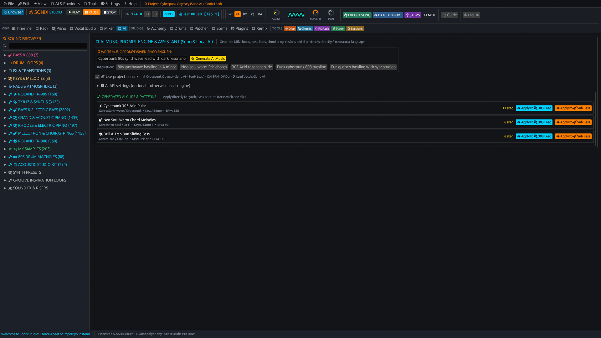

#### 8. ✨ Sonix Alchemy Synthesizer
Avancerad hybridsynt med 4 oscillatorvågformer (Sinus, Sågtand, Fyrkant, Triangel), ett resonant state-variable-filter, ADSR-envelope och en 8-punkters morph-vektorplatta.
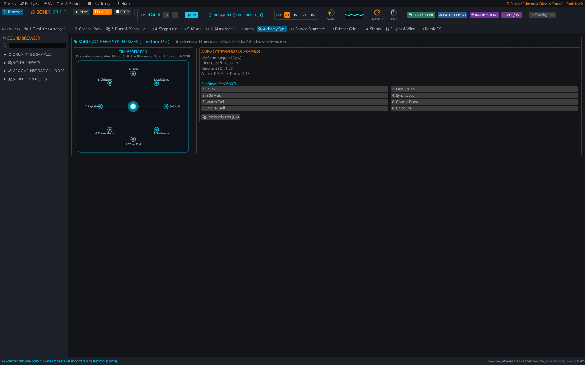

#### 9. 🥁 Dynamic Session Drummer
Interaktiv XY-kontrollmatris för groove-komplexitet och dynamik, med humanize-motor, stilvariationer och fill-ins.
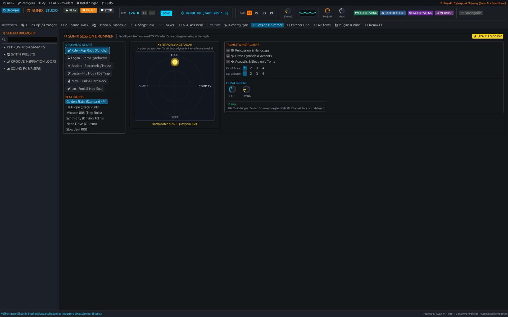

#### 10. 🧩 Modular Patcher & The Grid
Visuell modulär nod-miljö för att koppla ihop ljudsignaler, filter, envelopes, LFO och distorsion med virtuella patchkablar.
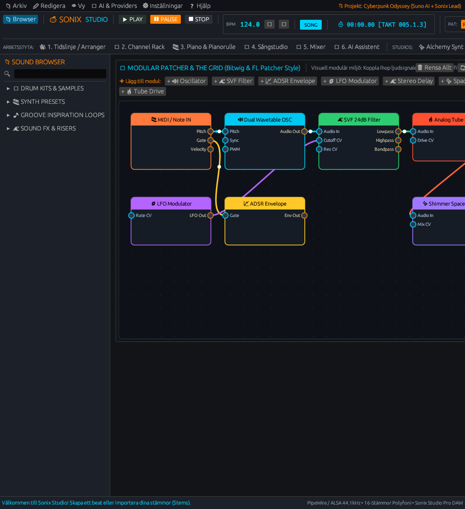

#### 11. 🧠 Stem Separator (DSP + valfri Neural ONNX)
Källseparation som isolerar sång, trummor, bas och instrument från färdiga mixar. Kör en lättvikts spektral-DSP som standard, eller en äkta HTDemucs-ONNX-modell när appen byggts med `--features neural` och en modell installerats.
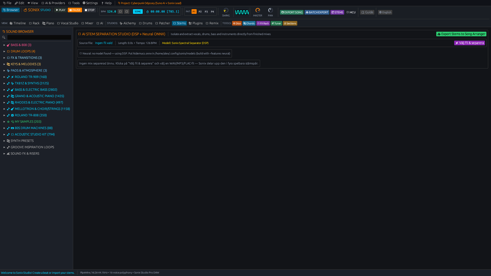

#### 12. 🔌 Plugin & VST/CLAP Bridge Manager
Katalogisering av FL Studio-`.fst`-presets samt CLAP-, VST3-, LV2- och Wine/Yabridge-pluginplatser (skanning & verifiering — CLAP-processning opt-in, övrig hosting ännu inte implementerad).
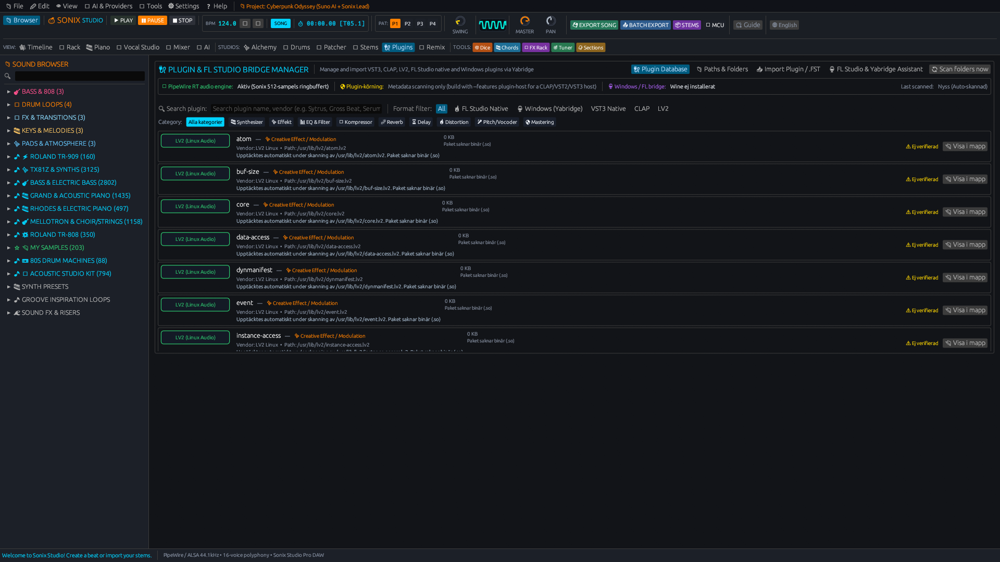

#### 13. 🎛 Remix FX (Live Performance Pad)
DJ-liveeffekter med Kaoss-liknande XY-matris, stutter-repeater, vinyl tape stop och reverse.
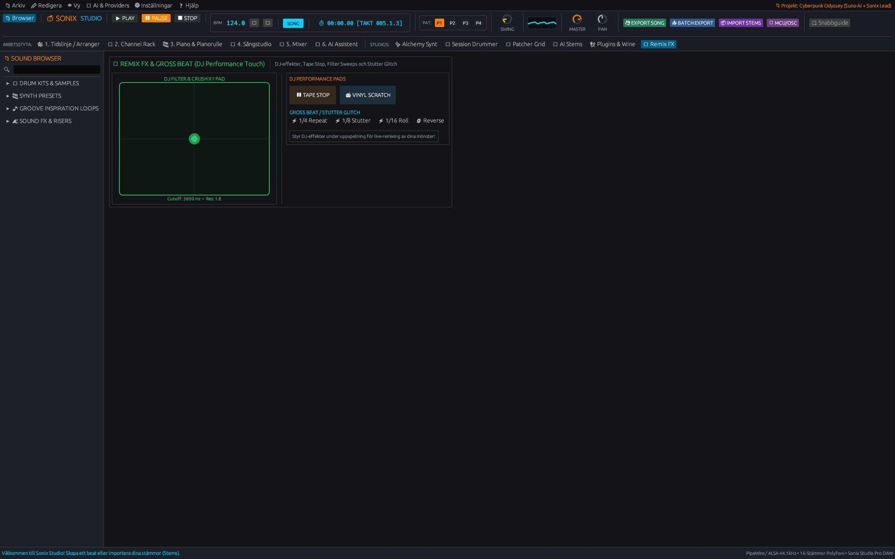

---

### 3. 🎙 Kreativa Studiopaneler & Sångmoduler (Soundtrap-Inspirerat)

#### 14. 🎤 Mikrofon & Hårdvaru-Röstpanel
Enhetsväljare, hårdvarugain (+0dB till +24dB), brusgrind (noise gate), akustisk återkopplingsdämpning och sångkaraktärer.
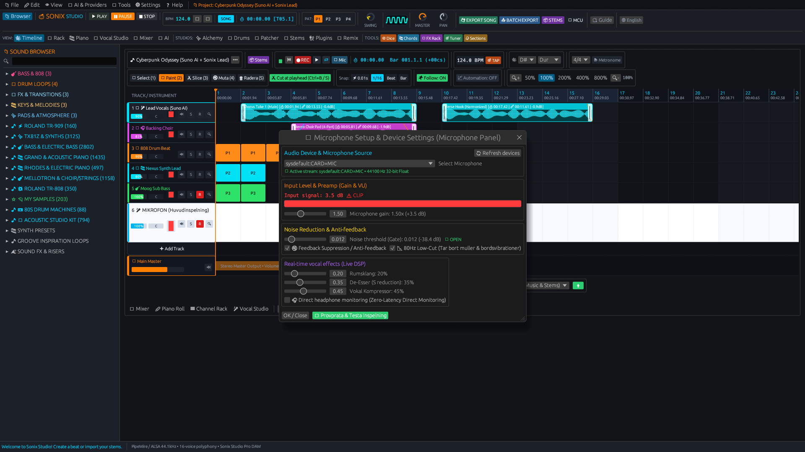

#### 15. 🎹 Smart Ackord- & Harmonimatris
Skalanpassad ackordmatris med romerska siffror, strum spread-humanisering, block/arpeggio-stilar och direktstämpling till Piano Roll.
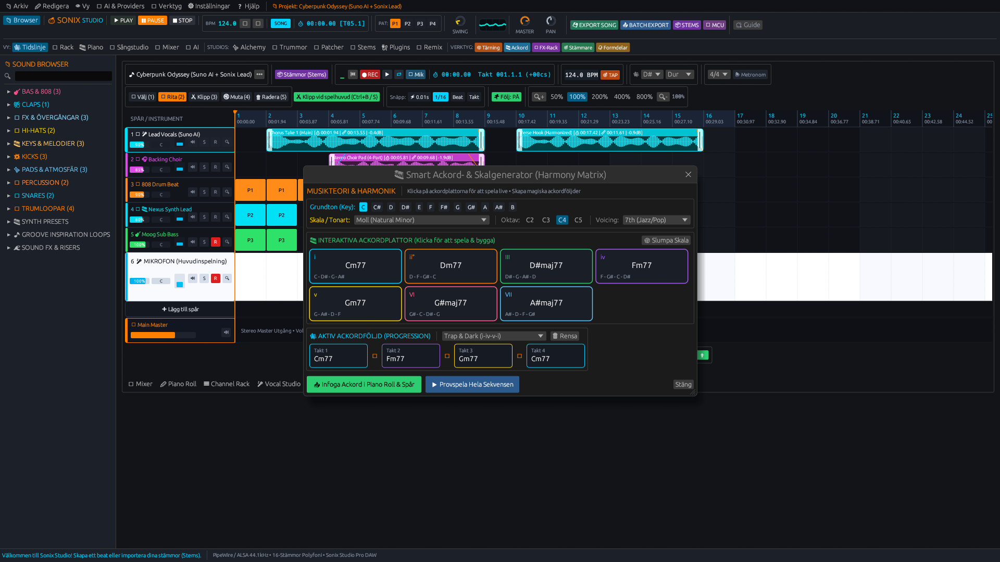

#### 16. 🎯 Hårdvaru-Strobetuner
Ultrahögprecisions kromatisk strobetuner med realtids frekvensanalys, ±cents-avvikelse och 440 Hz-kalibrering.
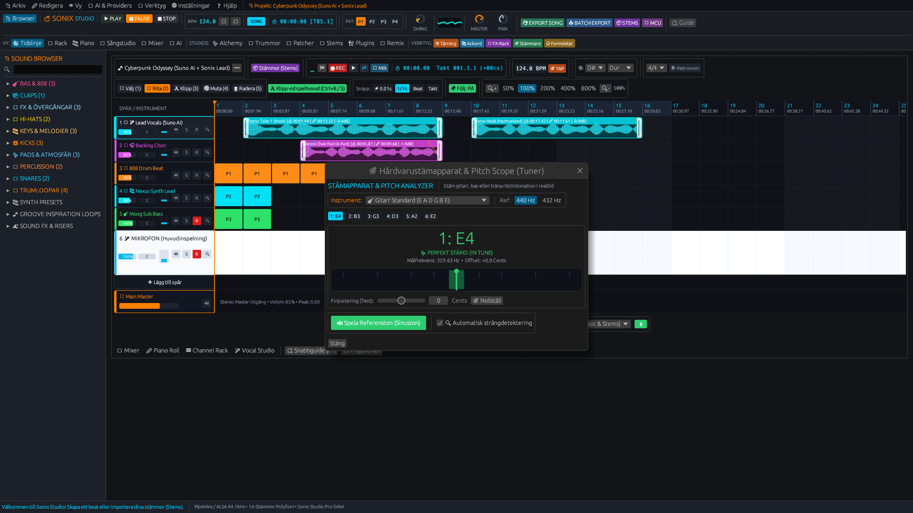

#### 17. 🎲 Beat- & Meloditärning
Algoritmisk generator för trumrytmer och melodislingor med musikaliska tonartslås och synkopkontroller.
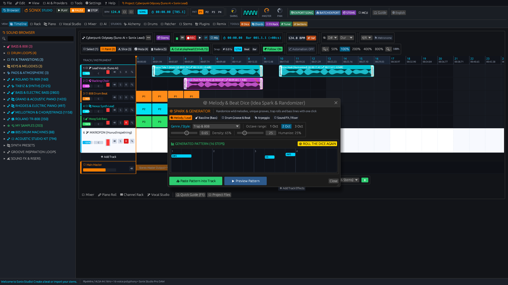

#### 18. 🎛 Modulärt FX-Pedalbord & Vocal Rack
Multieffektkedja med Vocal Doubler, Analog Rörkompressor, Dynamisk De-Esser, Brusgrind och Resonant Filter.
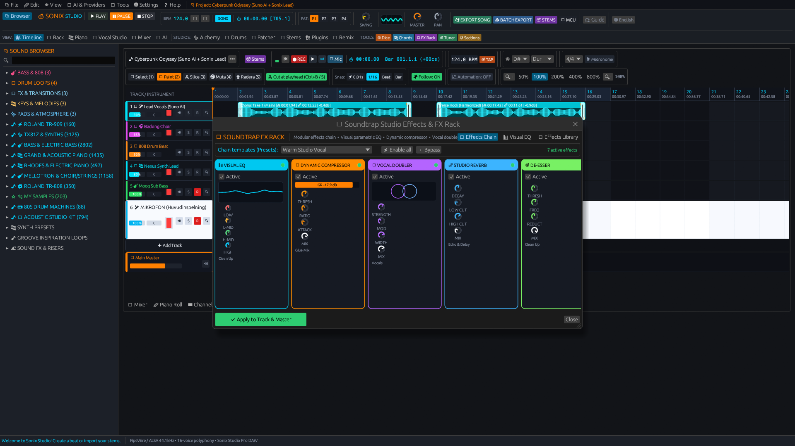

#### 19. 🎼 Låtstruktur-Arrangör
Definiera och arrangera sektioner för Intro, Vers, Refräng, Stick, Drop och Outro på tidslinjen.
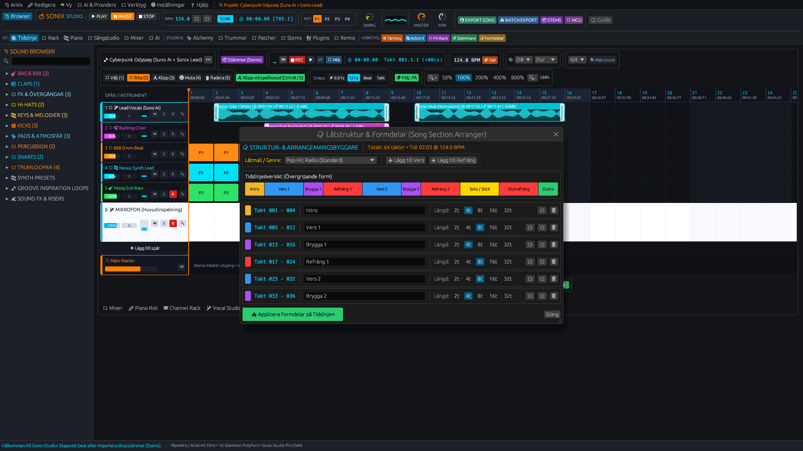

#### 20. ➕ Spårskapare (Add Track Creator)
Modal för att snabbt skapa Sång/Mikrofon-, Ljudsample-, 808 Trum-, Syntlead-, Bas- eller FX-buss-spår.
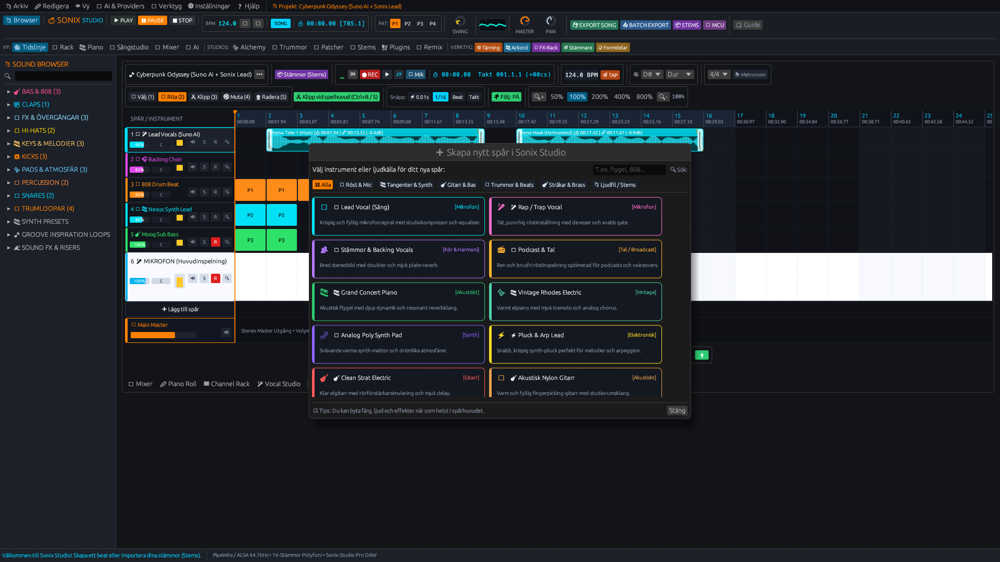

---

### 4. ⚙️ Dialogrutor, Modaler & Konfiguration

#### 21. ⚙ Ljud- & Systeminställningar
Visar verklig cpal-värd och utgångsenhet, den aktiva strömmen (samplingsfrekvens · buffert · kanaler) och låter dig applicera en ny samplingsfrekvens/buffert genom att bygga om strömmen live (sparas till `~/.config/sonix/audio.json`).
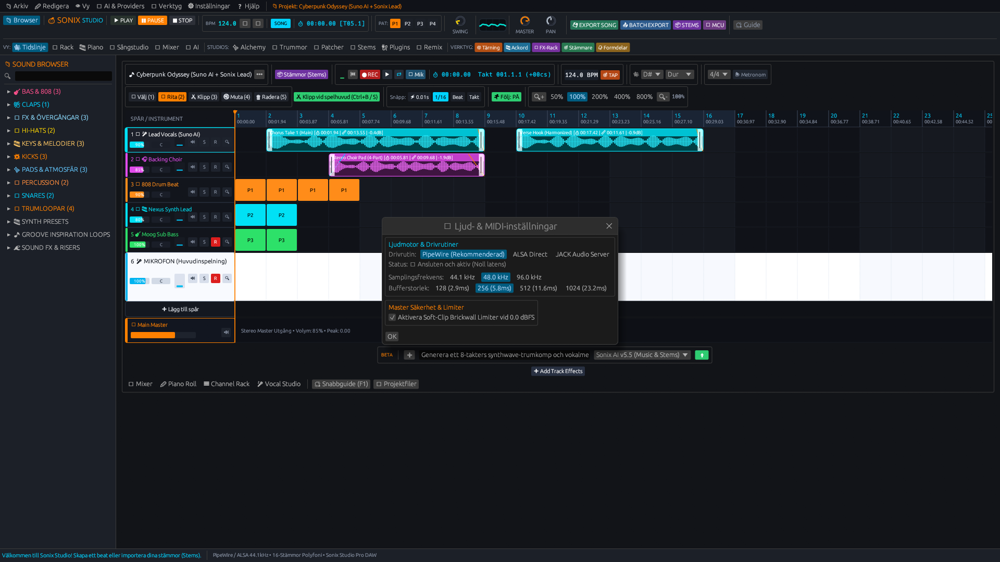

#### 22. 🤖 AI-Konfiguration & API-nycklar
Anslutningsinställningar för OpenAI GPT, Claude AI, OpenRouter och lokal Ollama-server. (Denna äldre modal är inte inkopplad — använd AI-assistentens egna inställningar.)


#### 23. 💾 Projekthanterare & Projektmallar
Skapa nya låtprojekt från mallar (Synthwave, Trap, House, Ambient) samt spara och öppna projekt.
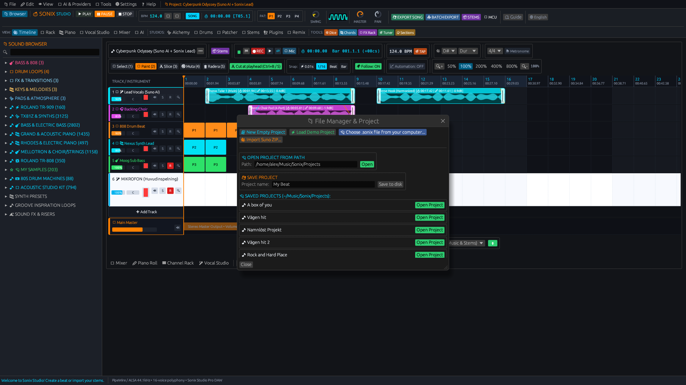

#### 24. 💿 Render & Master Export Queue
Offline-rendering av hela projektet (riktiga Channel Rack-WAV-samples + tidslinje-audio-stems + FX) till WAV (16/24-bit & float), FLAC (24-bit lossless), MP3 (320 kbps), OGG Vorbis och AAC/M4A. Välj mastermix eller per-spår torra/våta stems, samplingsfrekvens och ren metadata (titel/artist/album/genre/år/kommentar) som bara taggas med **Sonix Studio** – aldrig AI-/leverantörsinfo. WAV/FLAC kodas i appen; MP3/OGG/AAC via `ffmpeg` om det är installerat. Inkluderar **EBU R128 loudness-normalisering** (BS.1770 K-viktad grindad mätning + äkta-peak-tak via 4× oversampling) med leverans-presets i ett klick (Streaming/Apple Music/Broadcast/Klubb).
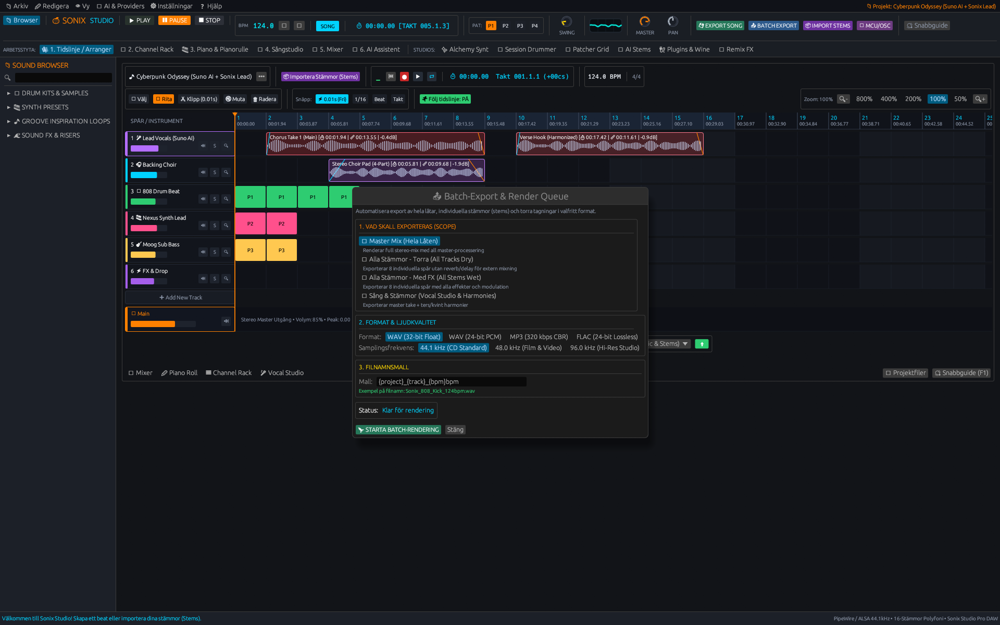

#### 25. 📥 Suno AI Stem Importör
Automatisk inläsning och uppackning av Suno AI-stems direkt från zip-arkiv eller mappar.
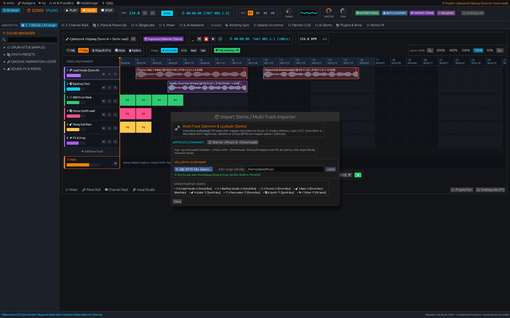

#### 26. 🎛 Hårdvarukontroller & MCU/OSC
Stöd för externa hårdvarukontroller (Behringer X-Touch, Novation Launchpad) via ALSA MIDI och OSC.
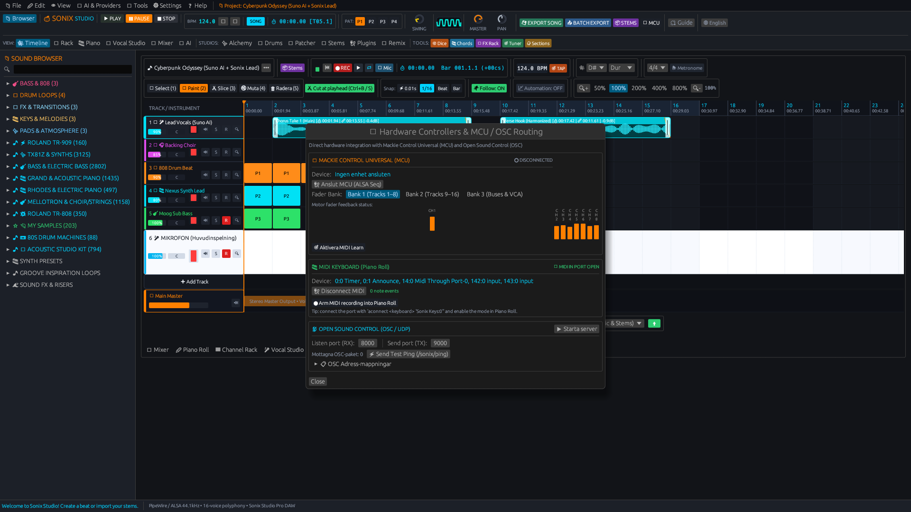

#### 27. 🔍 Fokuserad Stem & Region Editor
Detaljerad ljudregionsredigerare med volymkurva, fade in/out, reverse och sample slicing.
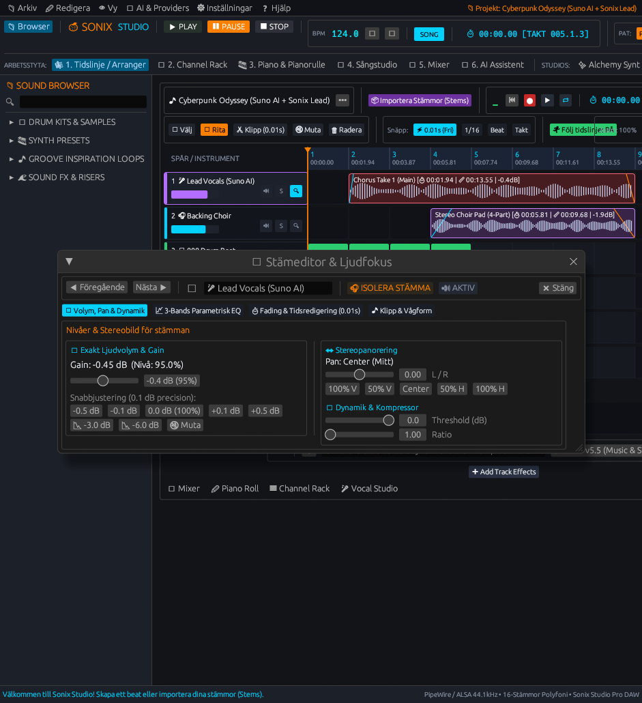

#### 28. 📖 Interaktiv Hjälpguide & Manual
Inbyggd snabbguide med kortkommandon, signalflödesscheman och arbetsflödesbeskrivningar.
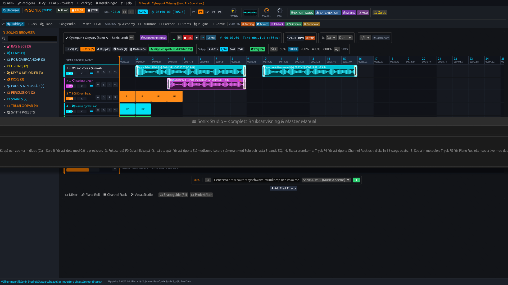

#### 29. ℹ Om Sonix Studio
Information om versionsnummer, ljudmotor, arkitektur och licens.
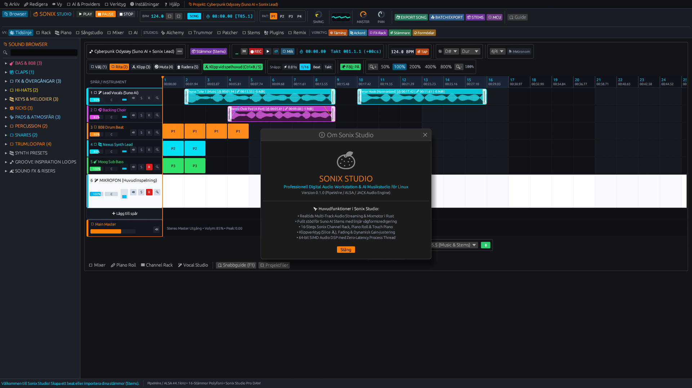


